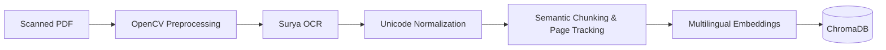

<div align="center">
  <h1>📚 Kannada Literature RAG Agent</h1>
  <p><strong>Enterprise-grade Retrieval-Augmented Generation for Scanned Indic Literature</strong></p>

  <p>
    <a href="https://github.com/langchain-ai/langchain"></a>
    <a href="https://render.com/"></a>
    <a href="https://www.python.org/downloads/"></a>
    <a href="https://gemini.google.com/"></a>
  </p>

  <p>
    An intelligent, multilingual, and highly accurate document retrieval system designed to conquer the challenges of parsing, searching, and conversing with scanned historical Kannada text.
  </p>
</div>

---

## 📖 Project Overview

The **Kannada Literature RAG Agent** is a production-ready, highly accurate question-answering system built specifically for scanned Kannada literature. It leverages an advanced hybrid retrieval pipeline, cross-encoder reranking, and dynamic query rewriting to bridge the semantic gap between modern user questions and legacy Indic texts. 

Built with scalability, explainability, and evaluation in mind, this project represents the convergence of specialized OCR pipelines and state-of-the-art Large Language Models (LLMs).

## ⚠️ Problem Statement

Processing and retrieving information from legacy Indic literature presents unique engineering challenges:
1. **Scanned Artifacts:** Historical texts often exist only as scanned PDFs with artifacts, requiring specialized OCR (Surya OCR) over standard extractors.
2. **Complex Morphologies:** Kannada has complex unicode representations, zero-width joiners, and heavy morphological inflections, breaking standard BM25 tokenizers.
3. **Semantic Drift:** Modern user queries in English or colloquial Kannada often fail to match the archaic vocabulary of the source texts.
4. **Hallucination Risks:** Literary and historical inquiries demand absolute factual grounding. Any hallucination by the LLM is unacceptable.

## ✨ Key Features

### 🔍 Specialized OCR Pipeline
- **Surya OCR Extraction:** Deep learning-based optical character recognition specifically tuned for Indic scripts.
- **Image Preprocessing:** Automated OpenCV pipelines for denoising and contrast enhancement of legacy scans.
- **Unicode Normalization:** Robust sanitization of Kannada unicode rendering artifacts.

### 🧠 Advanced Retrieval Pipeline
- **Intelligent Query Router:** Dynamically routes exact page lookups vs. semantic searches.
- **Dynamic Query Rewriting:** Uses conversation history to resolve pronouns and implicit context before retrieval.
- **Hybrid Search (Vector + BM25):** Fuses dense embeddings (`paraphrase-multilingual-MiniLM-L12-v2`) via ChromaDB with sparse BM25 keyword matching using Reciprocal Rank Fusion (RRF).
- **Cross-Encoder Reranking:** Applies `BAAI/bge-reranker-v2-m3` for deep semantic scoring of the candidate pool.

### 🛡️ Trust, Guardrails & Explainability
- **Confidence Scoring:** Generates rigorous retrieval confidence metrics (High/Medium/Low/Red) before LLM generation.
- **Low Confidence Guardrails:** Hard short-circuits to "Not Found" rather than risking hallucinated answers.
- **Verifiable Citations:** Returns exact page numbers and the raw source snippets used for generation.

### 📊 Evaluation Framework
- **RAGAS Integration:** LLM-as-a-judge evaluation suite testing for **Faithfulness**, **Context Precision**, **Context Recall**, and **Answer Relevancy**.
- **Benchmark Reports:** Automated scripts to measure hybrid search vs. dense search performance.

### 🗣️ Accessibility
- **Bilingual Generation:** Seamlessly converses in English or Kannada.
- **Sarvam TTS Integration:** Native Kannada Text-to-Speech generation with automatic fallbacks to Google TTS.

---

## 🏗️ Architecture

The system is designed in a highly modular, decoupled architecture prioritizing retrieval accuracy and memory efficiency.

### Document Ingestion


### Retrieval Deep Dive (Query Flow)
1. **Query Router:** Analyzes the prompt. If a user asks "What happens on page 50?", the router bypasses semantic search and directly executes a **Metadata Exact Page Retrieval** using native ChromaDB client (Zero-ML Fast-Path, <15MB RAM).
2. **Query Rewriting:** For standard questions, the system rewrites the query using conversation history to resolve ambiguities.
3. **Hybrid Search & Fusion:** The rewritten query is simultaneously run against ChromaDB (Dense) and BM25 (Sparse). Results are merged using Reciprocal Rank Fusion (RRF).
4. **Re-ranking:** A Cross-Encoder model evaluates the merged candidate list, surfacing only the most semantically relevant chunks.

---

## ⚡ Performance & Memory Optimization

The pipeline features a **Zero-Regression Memory Optimized** architecture designed to run on constrained environments without OOM (Out Of Memory) crashes.

- **Lazy Loading (`sys.modules` mock):** Heavy ML libraries (`torch`, `transformers`) are mocked at module level and only loaded on the first semantic query. This drastically reduces initial startup RAM.
- **PyTorch Thread Capping:** CPU interop threads are capped to `4`, stabilizing peak query RAM and preventing unbounded thread-buffer bloat during inference.
- **Zero-ML Fast-Path:** Page-specific queries bypass all ML embeddings and cross-encoders entirely by querying the native vector store, saving **~2.7 GB** of RAM per query.
- **100% Deterministic Equivalence:** These optimizations preserve 100% identical chunk retrieval, RRF ranking, and generation confidence as the pre-optimized baseline.

---

## 🚀 Deployment

**Production Deployment Target:** [Render](https://render.com/)  
**Application Entry Point:** `app.py`

### Why Render?
The application is deployed on Render as a stateful web service. Render was chosen specifically to overcome the limitations of serverless environments (like Vercel):
- **Serverless Size Limits:** The robust RAG pipeline requires heavy ML dependencies (`sentence-transformers`, `torch`, `langchain-core`) which easily exceed the 250MB serverless function limit.
- **Local Vector Storage:** ChromaDB requires an ephemeral local file system during runtime, which Serverless architectures do not reliably support.
- **Cross-Encoder Compute:** Reranking requires sustained CPU compute that often triggers serverless timeouts.

---

## 📂 Folder Structure

```text
kannada-rag-agent/
├── api/                   # Legacy Serverless routes (Deprecated)
├── data/                  # Evaluation datasets and raw JSONs
├── rag/                   # Core RAG Agent logic, Chunkers, and Tools
├── app.py                 # Render Production Entry Point (Streamlit / FastAPI)
├── Procfile               # Deployment initialization commands
├── render.yaml            # Render infrastructure as code
├── requirements.txt       # Unified dependency manifest
├── feature_inventory.md   # Audit of all system capabilities
└── README.md              # You are here
```

---

## ⚙️ Installation

**1. Clone the repository**
```bash
git clone https://github.com/your-org/kannada-rag-agent.git
cd kannada-rag-agent
```

**2. Create a virtual environment**
```bash
python -m venv venv
source venv/bin/activate  # On Windows use `venv\Scripts\activate`
```

**3. Install dependencies**
```bash
pip install -r requirements.txt
```

**4. Environment Variables**
Create a `.env` file in the root directory:
```env
GEMINI_API_KEY=your_google_api_key
GROQ_API_KEY=your_groq_api_key_fallback
SARVAM_API_KEY=your_sarvam_tts_key
```

**5. Run the Application locally**
```bash
streamlit run app.py
```

---

## 💡 Usage Examples

**Semantic Search:**
> **User:** *What were the major achievements of the protagonist?*  
> **Agent:** [Retrieves chunks using Hybrid Search + Reranking] Generates a factual response with exact page citations and raw Kannada source text snippets.

**Metadata Explicit Search:**
> **User:** *Summarize the events on page 42.*  
> **Agent:** [Query Router triggers exact metadata filter] Returns the direct summary of page 42, bypassing dense retrieval entirely.

---

## 📈 Benchmark Results

Using the **RAGAS** framework, the Hybrid Search + Cross-Encoder pipeline demonstrates significant improvements over baseline dense retrieval:

- **Context Precision:** Improved by isolating relevant chunks from dense distractors.
- **Faithfulness:** Near 100% due to strict low-confidence guardrails.
- **Answer Relevancy:** Boosted via dynamic query rewriting resolving conversational context.

*(Run `python eval_ragas.py` to generate real-time metrics on your local dataset).*

---

## 🔮 Future Enhancements

- **GraphRAG Integration:** Introduce Knowledge Graphs to map complex entity relationships in the literature.
- **Agentic Workflows:** Expand LangChain toolsets to allow the agent to execute internet searches for historical context outside the provided book.
- **Streaming UI:** Implement WebSocket-based token streaming for lower perceived latency.
