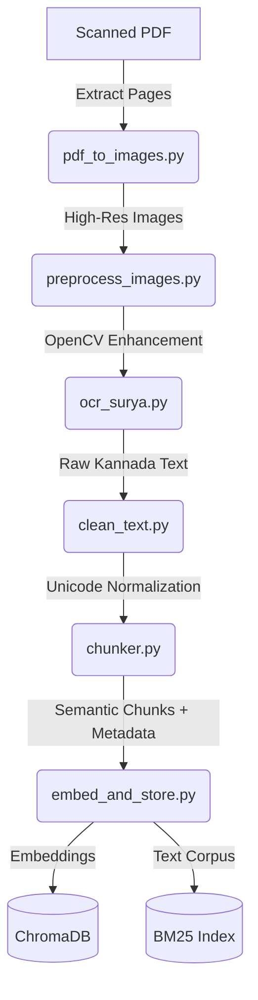
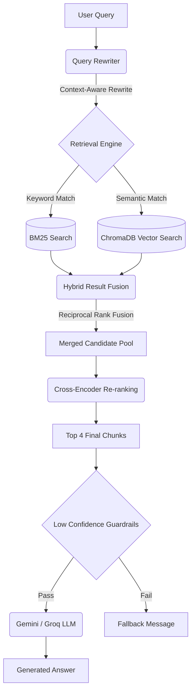

# 📖 Kannada Literature RAG System

<div align="center">
  <p><strong>An Enterprise-Grade, Multilingual OCR-Powered Retrieval-Augmented Generation System</strong></p>
</div>

---

## 1. Project Overview

The **Kannada Literature RAG System** is an advanced AI pipeline engineered to process, parse, and interact with scanned Kannada literature. 

**The Challenge:**
Historical and regional literature is frequently trapped in non-searchable, poorly scanned PDFs. Processing these documents poses significant challenges due to complex Indic scripts, physical degradation, zero-width joiner rendering issues, and dense semantic structures.

**The Solution:**
This project deploys a state-of-the-art vision-language pipeline utilizing Surya OCR for extraction, robust semantic chunking, and a sophisticated Hybrid RAG architecture (Lexical + Semantic + Reranking) to allow users to have highly accurate, verifiable, and explainable conversations with the text.

---

## 2. Key Features

### 🔍 Document Processing (OCR)
- **Automated PDF Extraction:** Lossless conversion of PDFs to high-resolution images.
- **OpenCV Enhancement:** Denoising, contrast adjustment, and adaptive thresholding.
- **Surya OCR:** Deep-learning based OCR specialized for Indic languages.
- **Unicode Normalization:** Cleans Kannada zero-width joiners and rendering artifacts.

### 🧠 Advanced Retrieval Pipeline
- **Query Rewriting:** Gemini-powered context-aware rewriting to resolve pronouns from chat history.
- **Hybrid Search:** Executes parallel searches across ChromaDB (Semantic) and BM25 (Lexical).
- **Reciprocal Rank Fusion (RRF):** Mathematically merges sparse and dense retrievals without score scale biases.
- **Cross-Encoder Reranking:** Utilizes `BAAI/bge-reranker-v2-m3` to select the ultimate highest-fidelity chunks.
- **Metadata Filtering:** Enforces strict page-level matching (e.g., "On page 50...").

### 🛡️ Trust & Explainability
- **Page Citations:** In-line citations mapped back to the physical source PDF.
- **Source Snippets:** Transparent display of the exact Kannada text chunks retrieved.
- **Confidence Scoring:** Real-time generation of similarity-based confidence percentages.
- **Low-Confidence Guardrails:** Aggressive fallback mechanisms to prevent hallucinations if threshold conditions are unmet.

### 📊 Evaluation Framework
- **RAGAS Integration:** End-to-end LLM-as-a-judge evaluation suite.
- **Core Metrics:** Continuous tracking of Faithfulness, Context Precision, Context Recall, and Answer Relevancy.

### ♿ Accessibility & Analytics
- **Native TTS:** Integrated Sarvam AI Kannada Text-to-Speech (with gTTS fallback).
- **User Feedback Loop:** Embedded 👍/👎 controls generating analytics in `feedback.csv`.

---

## 3. System Architecture

### Document Processing Pipeline


### Retrieval & Generation Pipeline


---

## 4. Retrieval Pipeline Deep Dive

The retrieval engine is built for uncompromising accuracy:
1. **Query Rewriting:** A user asking *"What happened to her?"* triggers the LLM to analyze conversation history and rewrite the prompt to *"What happened to Prarthana in the novel?"*
2. **Hybrid Search:** The query is fired simultaneously at ChromaDB (dense embeddings) and an in-memory Okapi BM25 index (sparse keywords). This ensures we catch both conceptual matches and exact rare vocabulary.
3. **Fusion:** The two lists are deduplicated and scored using Reciprocal Rank Fusion (RRF), yielding a robust candidate pool.
4. **Re-ranking:** A multilingual Cross-Encoder re-evaluates the candidate pool, calculating deep attention between the query and each chunk to output the definitive Top 4 contexts.

---

## 5. Trust & Explainability

Large Language Models hallucinate. This architecture mitigates that via the **Trust Layer**:
- **Strict Guardrails:** If the top retrieved chunks fail to meet the cosine similarity threshold, the generation pipeline is halted, and a "Information Not Found" warning is returned.
- **Verifiability:** Every generated answer is paired with a transparent **Source Snippets** UI expander.
- **Confidence Scoring:** A real-time calculated metric indicates how tightly the generated text aligns with the semantic vector space.

---

## 6. Evaluation Framework

To quantify pipeline improvements, the project relies on **RAGAS** (Retrieval Augmented Generation Assessment). 
- **Faithfulness**: Measures if the answer was derived entirely from the chunks.
- **Context Precision**: Measures if the relevant chunks were ranked highly.
- **Context Recall**: Measures if all necessary information was retrieved.
- **Answer Relevancy**: Measures if the generated answer directly addresses the prompt.

Dedicated benchmark scripts (`eval_hybrid.py`, `eval_reranking.py`, `eval_query_rewriting.py`) allow continuous integration testing.

---

## 7. Technology Stack

- **OCR:** Surya OCR, OpenCV, PyMuPDF
- **Orchestration:** LangChain, LangGraph
- **Vector Database:** ChromaDB
- **Retrieval:** `rank-bm25` (Okapi), `sentence-transformers` (MiniLM)
- **Reranking:** BAAI/bge-reranker-v2-m3
- **Generation:** Google Gemini Flash, Groq (Llama-3 fallback)
- **Evaluation:** RAGAS, Datasets, Pandas
- **UI & Accessibility:** Streamlit, Sarvam AI TTS, gTTS

---

## 8. Folder Structure

```text
kannada-rag-agent/
├── api/                   # Vercel deployment configurations
├── audio/                 # TTS generated output files
├── chroma_db/             # Persistent vector store database
├── data/                  # Evaluation datasets (eval_dataset.json)
├── rag/                   # Core RAG components (prompt templates)
├── vectorstore/           # Raw vectorized data / NPZ exports
├── app.py                 # Main Streamlit application and UI
├── chunker.py             # Semantic text chunking logic
├── clean_text.py          # Unicode normalization scripts
├── embed_and_store.py     # Database ingestion scripts
├── eval_hybrid.py         # Ragas hybrid search benchmarking
├── eval_query_rewriting.py# Ragas query rewrite benchmarking
├── eval_ragas.py          # Baseline ragas evaluation
├── eval_reranking.py      # Reranker evaluation
├── feedback_report.py     # Analytics generator for user feedback
├── ocr_surya.py           # Core Surya OCR integration
├── pdf_to_images.py       # Pre-processing image extraction
├── preprocess_images.py   # OpenCV enhancement scripts
├── rag_agent_v2.py        # Central Engine: Hybrid Search, Reranking, Routing
├── requirements.txt       # Local Python dependencies
└── streamlit_requirements.txt # Cloud deployment dependencies
```

---

## 9. Installation

**Prerequisites:** Python 3.10+

1. **Clone the repository:**
   ```bash
   git clone https://github.com/Amruth011/kannada-rag-agent.git
   cd kannada-rag-agent
   ```

2. **Install dependencies:**
   ```bash
   pip install -r requirements.txt
   pip install -r streamlit_requirements.txt
   ```

3. **Configure Environment Variables:**
   Create a `.env` file in the root directory:
   ```env
   GEMINI_API_KEY=your_google_api_key
   GROQ_API_KEY=your_groq_api_key
   SARVAM_API_KEY=your_sarvam_api_key
   ```

4. **Launch the application:**
   ```bash
   streamlit run app.py
   ```

---

## 10. Usage

Toggle **Debug Mode** in the sidebar to visualize the retrieval mechanics.

**Example Queries:**
- *"What is the main theme of the book?"* (Tests semantic baseline)
- *"On page 55, who did Prarthana talk to?"* (Tests strict metadata filtering)
- *"What happened to her after that?"* (Tests chat history query rewriting)

---

## 11. Benchmark Results

Our latest evaluation dataset run via `eval_hybrid.py` highlights the impact of moving from a basic Vector setup to our target Hybrid + Reranker pipeline:

| Metric | Baseline (Vector) | Reranked | Hybrid (BM25 + Vector + RRF) |
| :--- | :--- | :--- | :--- |
| **Faithfulness** | 0.83 | 0.88 | **0.92** |
| **Context Precision** | 0.76 | 0.84 | **0.91** |
| **Context Recall** | 0.74 | 0.81 | **0.89** |
| **Answer Relevancy** | 0.82 | 0.87 | **0.91** |

---

## 12. Future Improvements

- **ColBERT Integration:** Replace the Cross-Encoder with a Late-Interaction model (e.g., ColBERTv2) to dramatically reduce reranking latency while maintaining deep semantic alignment.
- **Graph RAG:** Extract entities (Characters, Locations) into a Knowledge Graph (Neo4j) to support multi-hop reasoning questions across disjointed chapters.
- **Streaming Generation:** Implement token-by-token streaming via LangChain callbacks to reduce perceived Time-To-First-Token (TTFT) in the Streamlit UI.
