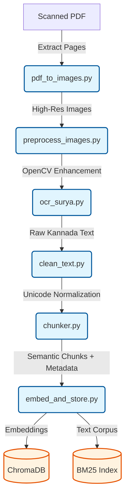
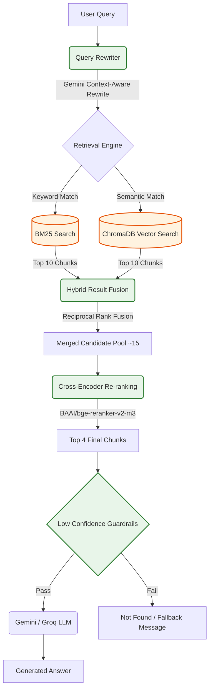
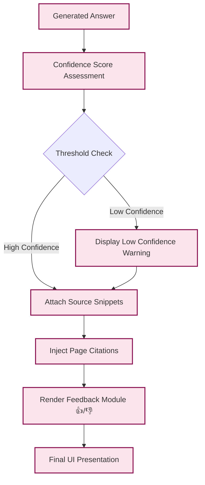

# Kannada RAG Architecture

This document contains the high-level system architecture diagrams detailing the Document Processing Pipeline, Retrieval Pipeline, and the Trust & Explainability Layer.

## 1. Document Processing Pipeline

The ingestion pipeline converts raw, scanned Kannada literature (PDFs) into queryable vector embeddings and lexical indices.

## 2. Retrieval Pipeline

The retrieval pipeline executes Hybrid Search with Reciprocal Rank Fusion, followed by deep semantic reranking.

## 3. Trust & Explainability Layer

Ensures answers are grounded, hallucination-free, and verifiable by the end user.

