# 🚀 Fast-Track 1-Day Official Instagram Launch Plan

If you want to skip the slow teasers and launch **officially and immediately**, this is your fast-track playbook. You can execute this entire plan in **under 30 minutes** to get the website live, start driving traffic, and capturing user interest.

---

## 🕒 The 30-Minute Launch Checklist

```mermaid
gantt
    title Immediate Launch Timeline (30 Mins Total)
    dateFormat  m
    axisFormat %M
    Update Bio & Links          :active, bio, 0, 5
    Publish 4-Story Launch Chain :active, story, 5, 15
    Record & Post Launch Reel    :active, reel, 15, 25
    Initiate DM Growth Loop      :active, loop, 25, 30
```

---

## ✍️ Step 1: Update Your Bio (5 Minutes)
Update your Instagram profile bio right now. Use one of these copy-paste templates to match your brand style:

### Option A: Literary & Intrigued (Recommended)
> 🥀 Heli Hogu Kaarana AI Novel Guide
> 🤖 Ravi Belagere ಅವರ ಕ್ಲಾಸಿಕ್ ಕಾದಂಬರಿ ಈಗ AI ರೂಪದಲ್ಲಿ!
> 🔊 Listen in Kannada & English
> 👇 Ask Himavanth your questions now:
> [Your Link Sticker/Bio Link: heli-hogu-kaarana.vercel.app]

### Option B: Short & Technical
> 🤖 Heli Hogu Kaarana — Interactive AI Guide
> 📖 Read Online | D3 Character Map | Audio Playback
> 💬 Ask Himavanth questions directly!
> 👇 Explore now:
> [Your Link Sticker/Bio Link: heli-hogu-kaarana.vercel.app]

---

## 📱 Step 2: The 4-Story Launch Chain (10 Minutes)
Post these 4 stories **sequentially, one right after the other**, using Instagram's native text and stickers. This creates an immediate sales funnel.

### Story 1: The Hook (Text Story)
* **Background:** Solid terracotta saffron (`#c2410c`) or warm ivory background.
* **Text (Playfair Display / Serif):** 
  *"ಹಿಮವಂತನ ಪ್ರೀತಿ ಮತ್ತು ತ್ಯಾಗದ ಬಗ್ಗೆ ನಿಮಗೆಷ್ಟು ಗೊತ್ತು?"*
  *(How much do you know about Himavanth's love and sacrifice?)*
* **Interactive Sticker:** Add a **Poll Sticker**:
  * Option 1: *"ತುಂಬಾ ಗೊತ್ತು"* (Know a lot)
  * Option 2: *"ತಿಳಿಬೇಕಿದೆ"* (Want to know)

### Story 2: The Solution (Video/Screenshot Story)
* **Visual:** A 15-second screen recording of your mobile browser opening the website, asking the AI: *"Why did Himavanth sacrifice his happiness?"*, and showing the text output and the D3 character map.
* **Text overlay:** *"Ravi Belagere ಅವರ ಕ್ಲಾಸಿಕ್ ಕಾದಂಬರಿಯನ್ನು ಈಗ AI ಸಹಾಯದಿಂದ ಓದಿ, ಚರ್ಚಿಸಿ ಮತ್ತು ಆಲಿಸಿ!"*

### Story 3: The Link (Action Story)
* **Visual:** A beautiful screenshot of the website's clean interface showing the quote block generator or character map.
* **Sticker:** Add a **Link Sticker** pointing to `https://heli-hogu-kaarana.vercel.app`.
* **Sticker Text:** *"Ask Himavanth Now 🔗"*
* **Text overlay:** *"Daily request limit (100 queries) to prevent system API abuse. Start asking now! 👇"*

### Story 4: Community Q&A Box
* **Visual:** Warm cream background with book cover icon.
* **Sticker:** Add a **Question Sticker** (Q&A box).
* **Question Title:** *"What do you want to ask Himavanth?"*
* **Text overlay:** *"We will ask the AI and post the best answers on our stories! 👇"*

---

## 🎬 Step 3: Record & Post the Launch Reel (10 Minutes)
Reels get 10x the organic reach of feed posts. Make a simple screen-recording reel.

### How to Record (5 mins):
1. Open [heli-hogu-kaarana.vercel.app](https://heli-hogu-kaarana.vercel.app) on your phone.
2. Turn on your screen recorder.
3. Type a query: *"ಹಿಮವಂತನ ತ್ಯಾಗದ ಬಗ್ಗೆ ವಿಶ್ಲೇಷಣೆ ನೀಡಿ"* (Provide analysis on Himavanth's sacrifice).
4. Tap the audio playback button to demonstrate the Kannada/English voice stream.
5. Zoom in slightly on the D3 interactive character map.
6. Stop recording. Crop it to 9:16 aspect ratio.

### How to Post (5 mins):
* **Trending Audio:** Search Instagram for a popular, low-volume soft/instrumental Kannada track (e.g., a violin or flute track from a classic movie).
* **Copy-Paste Caption:**
  > "Heli Hogu Kaarana AI Novel Guide is officially LIVE! 🥀🤖
  > 
  > Re-explore Ravi Belagere's legendary novel like never before. 
  > 
  > 🌟 Features:
  > • Ask anything about characters and plot in Kannada & English.
  > • Interactive visual character maps.
  > • Bilingual audio playback player.
  > • Read Online or Download Offline.
  > 
  > ⚠️ Daily request limit (100 queries) to prevent system API abuse!
  > 
  > 👉 **Link in bio!** Try it right now and tell us what you asked. 
  > 
  > #HeliHoguKaarana #KannadaRAG #KannadaAI #RaviBelagere #Himavanth #KannadaLiterature #KannadaReads #InstaKannada"

---

## 💬 Step 4: Comment-to-DM Growth Loop (5 Minutes)
To maximize conversion, write a pinned comment under your launch Reel:

> *"Type **'🥀'** or **'HIMAVANTH'** in the comments, and we will DM you the direct website link instantly! 👇"*

### How to execute this:
1. **Manual Way (Zero Cost):** Every time someone comments, copy-paste this direct message:
   > *"Hey! Thanks for the comment. Here is your direct link to the Heli Hogu Kaarana AI Guide: heli-hogu-kaarana.vercel.app 🥀 Enjoy asking Himavanth!"*
2. **Automated Way (ManyChat - Optional):** Set up a free ManyChat rule: *If user comments 'HIMAVANTH', send automated DM with link.*

---

## 📈 Tracking Results (End of Day)
Once launched, check your Admin feedback/telemetry dashboard on Vercel or your site analytics to see:
* Number of unique visitors from Instagram.
* Questions asked to the AI.
* Story replies you can screenshot for Day 2 stories!
