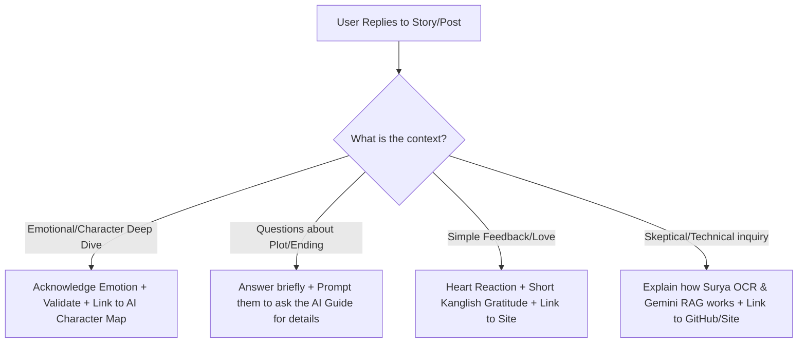

# Instagram Story & Post Contextual Reply Strategy

When launching a literary and emotional product like the **Heli Hogu Kaarana** AI Novel Guide, the depth of user engagement is your greatest asset. Readers do not just write "nice post"; they write paragraph-long emotional reflections (as shown in the reader's message about **Himavanta's** sacrifice). 

Responding to these messages with generic "Thanks for reading!" replies kills the connection. Instead, you must match their emotional frequency, validate their thoughts, and gently guide them to experience the AI Guide.

---

## 📸 The Reader's Reflection (Context)
The reader replied to your story hook: *"Himavanthana preeti mattu tyagada bagge neemegesthu gottu?"* with an incredibly detailed response:
* **Core Sentiment:** Himavanta's love is selfless like a mother's love for her child. He forgave her mistakes, supported her doctor dreams, trusted her completely, and when she left him for someone else, he didn't curse her—he saved her lover's life to prevent her from hurting, sacrificing his own life in the process.
* **Closing Thought:** *"Odida thakshana intavanu irtara anta anisidavanu"* (Immediately makes one think: do people like this exist?)

---

## 💬 Tailored Reply Templates for This Specific Message

Here are three distinct options you can copy-paste to reply to this reader, ranging from personal/conversational to deeply poetic.

### Option 1: Emotional & Personal (Kanglish) - *Recommended*
*Matches the user’s exact language style and feels like a genuine conversation.*

> "Nijavaglu tumba adbhutavagi heldri! 🥀 Himavanthana preethi sadharana preethiyalla, adu adhe thara nishkalmasha matthe niswartha preethi. Ravi Belagere avra writing shailiyalli aa character ge thumbiro jeeva ne alva adu? 'Odida thakshana intavanu irtara anta anisidavanu' antha neevu heldiddu 100% nija. 
> 
> Ee pathrada bagge innu tumba deep details and interactive analysis nodbeka? Navu run madtiro interactive AI guide nalli visual character map ide, link bio-nallide. Check madi mathye interact madi nodi! Link: heli-hogu-kaarana.vercel.app ✨"

### Option 2: Deeply Poetic & Respectful (Kannada Script)
*Elevates the response to a literary level, honoring their appreciation of the novel.*

> "ನಿಜಕ್ಕೂ ತುಂಬಾ ಅದ್ಭುತವಾಗಿ ಮತ್ತು ಆಳವಾಗಿ ವಿಶ್ಲೇಷಣೆ ಮಾಡಿದ್ದೀರಿ! 🥀 ಹಿಮವಂತನ ಪ್ರೀತಿ ಕೇವಲ ಪ್ರೀತಿಯಲ್ಲ, ಅದು ತಾಯಿಯ ನಿಸ್ವಾರ್ಥ ಪ್ರೇಮದಷ್ಟೇ ಪವಿತ್ರವಾದದ್ದು. 'ಪ್ರೀತಿಸಿದವಳ ಖುಷಿಗಾಗಿ ಎಲ್ಲವನ್ನೂ ಬಿಟ್ಟು ಹೋದವನು' ಅನ್ನೋ ಮಾತು ಅವನ ತ್ಯಾಗದ ಆಳವನ್ನು ತೋರಿಸುತ್ತೆ. ರವಿ ಬೆಳಗರೆ ಅವರ ಲೇಖನಿಯಲ್ಲಿ ಈ ಪಾತ್ರ ಎಷ್ಟು ಅಮರವಾಗಿ ಮೂಡಿಬಂದಿದೆ ಅನ್ನೋದಕ್ಕೆ ನಿಮ್ಮ ಈ ಸಾಲುಗಳೇ ಸಾಕ್ಷಿ.
> 
> ಹಿಮವಂತನ ಈ ಪ್ರೀತಿಯ ಸಫರ ಮತ್ತು ಅವನ ಪಾತ್ರದ ಸಂಪೂರ್ಣ ನಕ್ಷೆಯನ್ನು (D3 Character Map) ನೋಡಲು ಮತ್ತು ಅವನ ಬಗ್ಗೆ ಮತ್ತಷ್ಟು ಪ್ರಶ್ನೆಗಳನ್ನು ಕೇಳಲು ನಮ್ಮ ಹೊಸ AI ಗೈಡ್ ಅನ್ನು ಒಮ್ಮೆ ಪ್ರಯತ್ನಿಸಿ. ಲಿಂಕ್ ಬಯೋದಲ್ಲಿದೆ! 📖✨"

### Option 3: Short, Engaging, & Hook-based (Kanglish)
*Fast, punchy, and highly engaging with a clear call to action.*

> "Wow, what a beautiful response! 🥺❤️ Neevu heldinge, Himavanthana character tanna preethisidavala khushigaagi tanna prana ne panakkittavanu. Ee pathrada prathi ondu nishchala bhavane nodidaga 'nijavalu intavaru irtara?' antha yochane barodu sahaja.
> 
> Heli Hogu Kaarana AI novel guide website eegagle live ide. Bio-nalliರೋ link open madi, Himavanthana preeti mattu tyagada bagge innu hecchu questions AI ge keli, visual character connection map nodi. Let us know how you like it! 📖✨"

---

## 🧠 Strategic Framework for Instagram Contextual Replies

Use this framework to train yourself (or an automation tool) on how to reply to different types of story replies and post comments.

### 1. The 3-Step Reply Formula for Novels
Every contextual response should contain:
1. **Validation:** Agree with their emotional take. ("Yes, Himavanta's pain is real...")
2. **Deepening Quote/Context:** Mention a specific plot point. ("That scene where he listens to her dreams...")
3. **Bridge to AI:** Direct them to query the AI about that specific scene. ("Did you know you can ask our AI: *'Did Himavanta make the right choice in chapter 12?'* Try it via link in bio!")

### 2. Common Scenarios & Ready-to-Use Templates

| User Action / Sentiment | Sample User Message | Perfect Reply Template (Kanglish / Kannada) |
| :--- | :--- | :--- |
| **Story Reply: Debate Hook** | *"I think the heroine did wrong by leaving him."* | "Nija, tumba jana readers ide thara feel madtare. Ee relationship dynamics visual map nalli nodakke check out index.html character map. Ask AI: *'Was she justified?'* to see what the book says! Link in bio. 🥀" |
| **Story Reply: General Appreciation** | *"Ravi Belagere's best work. Heartbreaking."* | "True. Ee heart-touching stories na reconnect madoke ee AI guide launch madidivi. You can read online, check maps, or search chapters instantly. Try now, link in bio! 📖" |
| **Post Comment: Technical curiosity** | *"How is this guide built? Is it a simple search?"* | "Hey! It's built using Surya OCR for layout parsing, ChromaDB for semantic vector retrieval, and Gemini API for response generation. Open-source code is on GitHub. Link in bio! 💻⚡" |

---

## 🛠️ Setting Up DM & Comment Automation (No-Budget Tools)

If you get a high volume of replies, you can automate this using **free tiers of Instagram Automation tools (like ManyChat or Meta Business Suite)**:

1. **Trigger:** Set up a rule where if a user replies to any story containing the keyword **"Himavanth"** or **"Story"** or **"Book"**.
2. **Action:** Send an automated message that feels human:
   > *"Hey! Thanks for replying to the story. We built an interactive AI Guide where you can explore Himavanth's entire journey, read online, and ask your own questions. Try it here: heli-hogu-kaarana.vercel.app"*
3. **Personalization Rule:** For deep paragraphs, **turn off automation** and reply manually using the templates above. Manual replies build the strongest communities!
