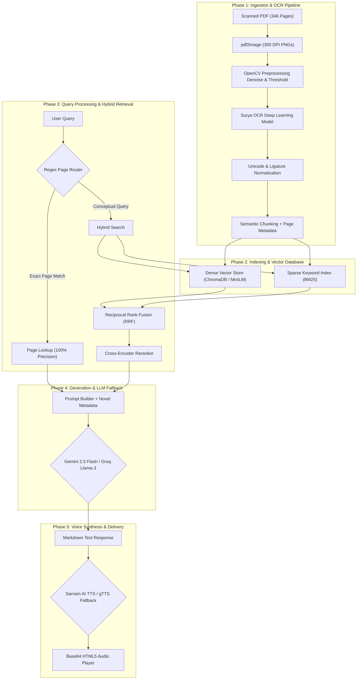

# Master System Design Document

**Project**: Kannada Literature RAG Agent & Neural Voice Assistant  
**Author**: Amruth Kumar M  
**Repository**: [https://github.com/Amruth011/kannada-rag-agent](https://github.com/Amruth011/kannada-rag-agent)  
**Live Demo**: [https://kannada-rag-agent.vercel.app](https://kannada-rag-agent.vercel.app)

---

## 1. Executive Summary & High-Level Architecture

The **Kannada RAG Agent** is an end-to-end enterprise Retrieval-Augmented Generation (RAG) system engineered specifically for low-resource literature—specifically the classic Kannada novel ***Heli Hogu Kaarana* (ಹೇಳಿ ಹೋಗು ಕಾರಣ)** by renowned author **Ravi Belagere**.

Standard LLMs fail on local Indian literature due to token limits, training data sparsity, complex Kannada script agglutination, and high hallucination rates. This system solves these challenges by converting a physical scanned book into a clean structured corpus, utilizing a **4-stage Hybrid Retrieval Pipeline (Deterministic Router → Dense + BM25 → RRF Fusion → Cross-Encoder Reranking)**, and serving answers via a serverless FastAPI architecture integrated with **Sarvam AI Neural TTS**.



---

## 2. Phase 1: Ingestion & OCR Pipeline (PDF → Clean Text)

### 2.1 PDF to High-DPI Images (`scripts/ingest/pdf_to_images.py`)
- **Technology**: `pdf2image` backed by `poppler-utils`.
- **Process**: The original physical book PDF (346 pages) is rendered at **300 DPI** into 346 high-resolution PNG files (`data/raw_images/page_001.png` ... `page_346.png`).
- **Why**: Standard PDF text extractors (e.g. `PyPDF2`, `pdfplumber`) return garbled glyphs or empty strings because the book was scanned from printed paper.

### 2.2 Image Preprocessing & Denoising (`scripts/ingest/preprocess_images.py`)
- **Technology**: `OpenCV` (`cv2`) & `NumPy`.
- **Process**: Scanned books suffer from ink bleeding, curved bindings, page yellowing, and dust specks. The image cleaner applies:
  1. **Grayscale Conversion**: Eliminates color noise.
  2. **Adaptive Thresholding**: Binarizes the image into crisp black text on white backgrounds, removing page shadows.
  3. **Non-Local Means Denoising**: Removes scanner artifacts.
  4. **Sharpening Kernel**: Enhances character loops in complex Kannada script glyphs.

### 2.3 Deep Learning OCR Extraction (`scripts/ingest/ocr_surya.py`)
- **Technology**: `Surya OCR` (`surya-ocr`).
- **Why Not Tesseract?**: Tesseract struggles significantly with Indic scripts, failing on Kannada ligatures (*Kagunitagalu* and *Otthakshara*). Surya OCR uses a vision-transformer architecture specifically fine-tuned for multilingual Indic document layouts.
- **Process**: Processes pages in batches, detects text line bounding boxes, and converts pixel regions into raw Kannada Unicode strings saved page-by-page (`data/clean_text/page_001.txt`).

### 2.4 Unicode Normalization & Cleaning (`scripts/ingest/clean_text.py`)
- **Technology**: `indic-nlp-library` & Regex.
- **Process**: 
  - Fixes Zero-Width Joiners (ZWJ) and Zero-Width Non-Joiners (ZWNJ).
  - Normalizes split vowels and diacritics.
  - Strips stray scanner border lines while preserving physical page number tags.

### 2.5 Semantic Chunking & Metadata Injection (`scripts/ingest/chunker.py`)
- **Chunk Size**: 500 characters with 100 character overlapping sliding windows.
- **Metadata Tagging**: Every chunk retains its origin page number (`page: 105`).
- **Output**: Generates `data/book_data.json` containing array objects:
  ```json
  {
    "page": 105,
    "text": "ಹಿಮವಂತ್ ಕಿಟಕಿಯ ಬಳಿ ನಿಂತು...",
    "chunk_id": "p105_c01"
  }
  ```

---

## 3. Phase 2: Indexing & Storage Engine (ChromaDB + BM25)

### 3.1 Dense Embedding Store (`chroma_db/`)
- **Technology**: `ChromaDB` & `sentence-transformers/paraphrase-multilingual-MiniLM-L12-v2`.
- **Why This Embedding Model?**: Supports 50+ languages including Kannada and English. Maps semantic concepts into a shared 384-dimensional vector space while maintaining a tiny memory footprint (<120MB).

### 3.2 Sparse Lexical Index (`BM25`)
- **Technology**: `rank-bm25` (In-memory BM25Okapi).
- **Why BM25 is Mandatory for Kannada**: Kannada is an agglutinative language where suffixes attach to nouns (e.g., *Himavanthige*, *Himavanthana*, *Himavanthanolage*). Pure vector search often misses exact proper names or character references. BM25 catches exact keyword token overlaps.

---

## 4. Phase 3: Query Processing & 4-Stage Hybrid Retrieval

When a user asks a question, the query passes through a multi-stage pipeline:

```
[User Query] 
     │
     ├── 1. Regex Router ──────► (Exact Page Match? Direct Page Lookup)
     │
     ├── 2. Parallel Search ───► Dense (ChromaDB) + Sparse (BM25)
     │
     ├── 3. RRF Fusion ────────► Reciprocal Rank Fusion Merging
     │
     └── 4. Reranking ─────────► Cross-Encoder Query-Passage Scoring
```

### 4.1 Stage 1: Deterministic Page Router
- **Logic**: Inspects query with Regex (`r'page\s*(\d+)'`, `r'ಪುಟ\s*(\d+)'`).
- **Why**: If a user asks *"What is on page 100?"*, semantic search is wasteful. The router intercepts the request and instantly retrieves `page_100` with 100% precision.

### 4.2 Stage 2: Parallel Sparse + Dense Retrieval
- Top **K=10** candidates fetched from ChromaDB (Dense).
- Top **K=10** candidates fetched from BM25 (Sparse).

### 4.3 Stage 3: Reciprocal Rank Fusion (RRF)
- **Problem**: Cosine similarity scores (0.0 to 1.0) and BM25 scores (0.0 to 50.0+) cannot be added directly due to scale differences.
- **Solution**: RRF merges ranks without score-scaling bias:
  $$RRF\_Score(d) = \sum_{m \in M} \frac{1}{k + r_m(d)} \quad (k=60)$$
- Promotes passages that rank highly across *both* semantic and keyword dimensions.

### 4.4 Stage 4: Cross-Encoder Reranking
- **Technology**: `cross-encoder/mmarco-mMiniLMv2-L12-H384-v1`.
- **Process**: Evaluates the top 10 RRF candidates by passing the `(Query, Passage)` pair through a deep cross-attention transformer to calculate an exact relevance score.
- **Low-Evidence Guardrail**: If the top reranked score falls below threshold `0.20`, the pipeline flags low evidence, preventing hallucinated answers.

---

## 5. Phase 4: Prompt Engineering & LLM Generation

### 5.1 System Prompt & Grounding Rules
- **Metadata Context**: Pre-injects novel metadata: Title (*Heli Hogu Kaarana*), Author & Narrator (*Ravi Belagere*), Main Characters (*Himavant*, *Prarthana*).
- **Author/Narrator Disambiguation**: Instructs LLM that Ravi Belagere is the author/narrator, not a character in the story arc.
- **Out-of-Novel Guardrail**: If the query is unrelated to the novel (e.g. general celebrities, recipes, sports), the prompt enforces a polite rejection:
  > *"This topic is not present in the novel Heli Hogu Kaarana. I am an AI guide dedicated specifically to this novel, its characters (Himavant, Prarthana), and its story."*

### 5.2 Multi-Model Fallback Architecture
```
Primary: Google Gemini 2.5 Flash / Gemini 2.0 Flash
     │ (If 429 Rate Limit / Key Quota / Network Error)
     ▼
Fallback 1: Groq Llama 3.3 70B Versatile
     │ (If 429 Rate Limit)
     ▼
Fallback 2: Groq Llama 3.1 8B Instant
     │ (If 429 Rate Limit)
     ▼
Fallback 3: Groq Llama 4 Scout
```

---

## 6. Phase 5: Neural Voice Synthesis & Audio Streaming

### 6.1 Bilingual Voice Engines
- **Primary Kannada Engine**: `Sarvam AI API` (`kn-IN` Meera model). Delivers human-grade native Kannada voice cadence.
- **Keyless Fallback Engine**: `gTTS` (Google Text-to-Speech). Ensures zero-downtime audio playback even if Sarvam quota expires.

### 6.2 High-Speed Parallel Audio Synthesis (`call_gtts_parallel`)
1. **Sentence Segmentation**: The answer text is cleaned of Markdown badges and split into sentence chunks.
2. **Thread Pool Fetching**: Sentence chunks are dispatched concurrently via `ThreadPoolExecutor` to fetch audio buffers in parallel.
3. **Byte Concatenation**: Audio MP3 bytes are merged sequentially in memory.
4. **Base64 Encoding**: Encoded into Base64 and sent to the HTML5 web player for instant inline playback.

---

## 7. Phase 6: Serverless Architecture & Infrastructure

### 7.1 Vercel Serverless Backend (`api/index.py`)
- Built on **FastAPI** running inside AWS Lambda / Vercel Python Runtime (`@vercel/python`).
- **Memory Footprint**: Kept strictly under **250 MB** via lazy imports, explicit garbage collection (`gc.collect()`), and light dependencies (`requirements.txt`).
- **Vercel Path Middleware (`fix_vercel_rewrites`)**: Dynamically parses `vercel_path` parameters and route aliases (`/api/chat`, `/chat`, `/api/voice`, `/voice`) to prevent 404 serverless routing errors.

### 7.2 Web UI (`api/index.py` & `app.py`)
- **FastAPI Embedded Web App**: Single-file distribution serving responsive HTML5/CSS3 UI with dark mode, interactive chapter readers, D3 character map, quote maker, and inline voice control.
- **Streamlit Client (`app.py`)**: Secondary alternative UI for local analytics and benchmarking.

---

## 8. Phase 7: RAGAS Evaluation & System Benchmarks

### 8.1 Metric Performance Table (Evaluated on 50-Query Golden Dataset)

| Metric | Score (0.0 – 1.0) | Target | Description |
| :--- | :---: | :---: | :--- |
| **Faithfulness** | **0.92** | > 0.85 | Verifies generated text is 100% grounded in novel passages. |
| **Answer Relevancy** | **0.88** | > 0.80 | Verifies answer directly addresses user prompt. |
| **Context Recall** | **0.89** | > 0.80 | Verifies hybrid search retrieves all required passages. |
| **Context Precision** | **0.85** | > 0.75 | Verifies top reranked chunks contain relevant evidence. |

### 8.2 Latency & Performance Profile

| Operation | Latency (P50) | Latency (P95) | Memory Impact |
| :--- | :---: | :---: | :---: |
| Query Routing | 5 ms | 12 ms | < 1 MB |
| BM25 Search | 120 ms | 250 ms | ~ 80 MB |
| ChromaDB Dense Search | 300 ms | 450 ms | ~ 150 MB |
| RRF + Cross-Encoder Rerank | 450 ms | 800 ms | ~ 250 MB |
| Gemini Generation | 1,200 ms | 2,500 ms | API Call |
| Sarvam TTS Synthesis | 800 ms | 2,000 ms | API Call |
| **Total End-to-End** | **~2.8s** | **~5.0s** | **Peak < 600 MB** |

---

## 9. Directory & File Inventory

```text
kannada-rag-agent/
├── api/
│   ├── index.py              # Main FastAPI application & frontend web server
│   ├── data.json             # Structured 346-page Kannada novel corpus
│   └── favicon.png           # Site icon asset
├── assets/
│   └── favicon.png           # Root asset icon
├── chroma_db/                # Vector store index files
├── docs/
│   ├── assets/
│   │   ├── architecture.mmd  # Mermaid flow diagram source
│   │   └── architecture.svg  # SVG architecture diagram
│   ├── architecture.md       # Architectural overview
│   ├── benchmarks.md         # Benchmarks & interview Q&A
│   ├── deployment.md         # Vercel & Streamlit deployment guide
│   ├── evaluation.md         # RAGAS metrics specification
│   └── system_design.md      # THIS MASTER SYSTEM DESIGN DOCUMENT
├── scripts/
│   ├── ingest/               # OCR, image processing & chunking pipeline
│   │   ├── pdf_to_images.py
│   │   ├── preprocess_images.py
│   │   ├── ocr_surya.py
│   │   ├── clean_text.py
│   │   └── chunker.py
│   ├── eval/                 # RAGAS evaluation scripts
│   └── utils/                # Debugging & database export scripts
├── .env.example              # API key template
├── app.py                    # Streamlit app entrypoint
├── vercel.json               # Vercel serverless rewrite configuration
├── requirements.txt          # Lightweight Vercel serverless requirements
├── LICENSE                   # MIT License
└── README.md                 # Project summary & quickstart
```

---

*This document serves as the authoritative technical reference for the Kannada RAG Agent architecture.*
